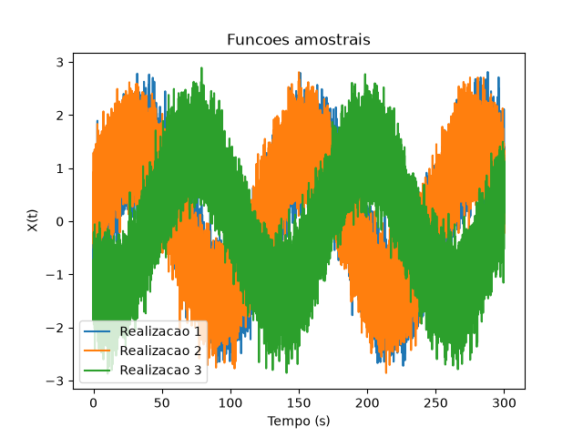
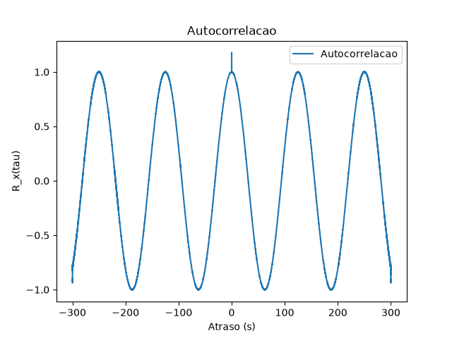

# Simulador de Autocorrelação de Processos Aleatórios

Projeto em C++ desenvolvido para a disciplina **Comunicações Analógicas e Digitais II — IME**.

O programa gera funções amostrais de uma senoide com fase aleatória e ruído gaussiano aditivo, calcula sua autocorrelação e gera os respectivos gráficos.

## Processo Aleatório

O processo analisado é:

$$X(t)=A\cos(2\pi f_c t+\Theta)+W(t)$$

com:

* $A=\sqrt{2}$;
* $f_c=8\times10^{-3}\ \text{Hz}$;
* $\Theta \sim U(0,2\pi)$;
* $W(t)$: ruído gaussiano de média nula;
* SNRs analisadas: **15 dB, 5 dB e 0 dB**.

Cada realização possui:

```text
N = 30000 amostras
dt = 0.01 s
```

São geradas **100 funções amostrais**.

---

## Estrutura

```text
projeto/
├── include/
│   ├── constantes.h
│   ├── variaveis_aleatorias.h
│   ├── sinal.h
│   └── autocorrelacao.h
│
├── src/
│   ├── variaveis_aleatorias.cpp
│   ├── sinal.cpp
│   └── autocorrelacao.cpp
│
├── build/
├── graficos/
├── main.cpp
├── matplotlibcpp.h
├── Makefile
└── README.md
```

* `include/`: declarações e constantes;
* `src/`: implementação dos algoritmos;
* `build/`: arquivos objeto `.o`;
* `graficos/`: resultados gerados.

---

## Geração das Realizações

Para cada realização $m$, uma fase aleatória $\Theta_m$ é gerada e mantida constante:

$$X_m(t_i)=\sqrt{2}\cos(2\pi f_c t_i+\Theta_m)+W_m(t_i)$$

com:

$$t_i=i\Delta t$$

e

$$W_m(t_i)\sim\mathcal{N}(0,\sigma_W^2)$$

As realizações são armazenadas em:

```cpp
std::vector<std::vector<double>> realizacoes;
```

onde:

```cpp
realizacoes[m][i]
```

representa a amostra `i` da realização `m`.

---

## SNR e Variância do Ruído

Como a potência da senoide é:

$$P_s=\frac{A^2}{2}=1$$

e

$$SNR_{dB}=10\log_{10}\left(\frac{P_s}{P_w}\right)$$

a variância do ruído é:

$$\sigma_W^2=P_w=10^{-SNR_{dB}/10}$$

---

## Autocorrelação

A autocorrelação é estimada por:

$$\hat{R}_X[k]=\frac{1}{M}\sum_{m=0}^{M-1}\left[\frac{1}{N-k}\sum_{i=0}^{N-k-1}X_m[i]X_m[i+k]\right]$$

onde:

* $M=100$;
* $N=30000$;
* $k$ é o atraso em amostras;
* $\tau=k\Delta t$ é o atraso em segundos.

Como a autocorrelação de sinais reais é par:

$$R_X(-\tau)=R_X(\tau)$$

somente os atrasos positivos precisam ser calculados; os negativos são obtidos por espelhamento.

---

## Resultados

Para cada valor de SNR são gerados:

* 3 funções amostrais;
* 1 função de autocorrelação.

### Funções amostrais



### Autocorrelação



---

## Dependências

* C++17 ou superior;
* G++;
* Python 3;
* Matplotlib;
* `matplotlib-cpp`.

Em Ubuntu/WSL:

```bash
sudo apt update
sudo apt install build-essential python3-dev python3-matplotlib
```

---

## Compilação

```bash
make
```

Para limpar os arquivos gerados:

```bash
make clean
```

Para recompilar:

```bash
make clean
make
```
